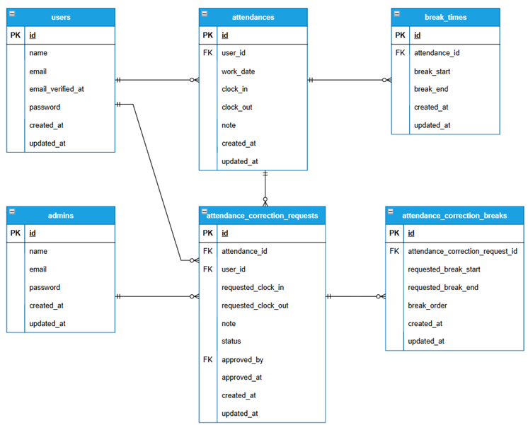

# coachtech 勤怠管理アプリ

## アプリ概要

本アプリは、一般ユーザーと管理者の2種類のユーザーに対応した勤怠管理Webアプリです。
一般ユーザーは出勤・休憩・退勤の打刻、勤怠修正申請、勤怠一覧・レポートの閲覧を行うことができます。
管理者は勤怠情報の管理、勤怠修正、修正申請の承認、スタッフごとの勤怠管理、CSV出力を行うことができます。
また、REST APIを実装し、勤怠情報の取得・登録・更新・削除にも対応しています。
ユーザー認証にはメール認証機能を導入し、安全にサービスを利用できる設計としています。
設計から実装、テストまで一貫して開発しています。

---

## 機能一覧

### 一般ユーザー

- 会員登録
- ログイン
- メール認証
- 出勤
- 休憩開始
- 休憩終了
- 退勤
- 勤怠一覧表示
- 勤怠詳細表示
- 勤怠修正申請
- 申請一覧表示
- 勤怠レポート表示

### 管理者

- ログイン
- 当日勤怠一覧表示
- 勤怠詳細表示・修正
- スタッフ一覧表示
- スタッフ別勤怠一覧表示
- スタッフ別勤怠CSV出力
- 修正申請一覧表示
- 修正申請承認

### API

- 勤怠一覧取得
- 勤怠詳細取得
- 勤怠登録
- 勤怠更新
- 勤怠削除

---

## 環境構築

### バックエンド（Laravel）

#### Dockerビルド

```bash
git clone git@github.com:misone-ne/test-attendance-app.git
cd test-attendance-app

docker compose up -d --build
```

#### Laravel環境構築

```bash
docker compose exec php composer install

cp src/.env.example src/.env
```

#### .env を以下のように設定してください

```env
DB_CONNECTION=mysql
DB_HOST=mysql
DB_PORT=3306
DB_DATABASE=attendance
DB_USERNAME=laravel_user
DB_PASSWORD=laravel_pass
```

```env
MAIL_MAILER=smtp
MAIL_HOST=mailhog
MAIL_PORT=1025
MAIL_USERNAME=null
MAIL_PASSWORD=null
MAIL_ENCRYPTION=null
MAIL_FROM_ADDRESS="test@example.com"
MAIL_FROM_NAME="${APP_NAME}"
```

#### アプリケーションキー生成

```bash
docker compose exec php php artisan key:generate
```

#### マイグレーション・シーディング

```bash
docker compose exec php php artisan migrate:fresh --seed
```

---

### フロントエンド（Vite）

本アプリではSCSSコンパイルにViteを使用しています。

#### Nodeモジュールインストール

```bash
docker compose exec node npm install
```

#### 開発環境起動

```bash
docker compose exec node npm run dev
```

#### 本番ビルド

```bash
docker compose exec node npm run build
```

---

## ダミーデータ

Seederにより一般ユーザー・管理者のダミーデータを登録しています。

### 一般ユーザー

#### ユーザー1

```
メールアドレス：user1@example.com
パスワード：password
```

#### ユーザー2

```
メールアドレス：user2@example.com
パスワード：password
```

※ユーザー1・ユーザー2ともにメール認証済みです。

### 管理者

```
メールアドレス：user3@example.com
パスワード：password
```

※メール認証済みです。

---

### 管理者テーブルについて

要件書では管理者を `users` テーブルで管理する例が示されていますが、本アプリでは認証を一般ユーザーと分離するため、管理者専用の `admins` テーブルを採用しています。
一般ユーザーは `users` テーブル、管理者は `admins` テーブルで認証・管理を行う設計としています。

---

## API

| Method | URL                             | 内容         |
| ------ | ------------------------------- | ------------ |
| GET    | /api/v1/attendance-records      | 勤怠一覧取得 |
| GET    | /api/v1/attendance-records/{id} | 勤怠詳細取得 |
| POST   | /api/v1/attendance-records      | 勤怠登録     |
| PUT    | /api/v1/attendance-records/{id} | 勤怠更新     |
| DELETE | /api/v1/attendance-records/{id} | 勤怠削除     |

---

## 使用技術（実行環境）

### バックエンド

- PHP
- Laravel

### フロントエンド

- Blade
- SCSS
- Vite

### データベース

- MySQL

### インフラ・開発環境

- Docker
- Docker Compose
- Nginx
- phpMyAdmin
- MailHog

### API

- Laravel Sanctum

### その他

- Node.js
- Composer
- Git
- GitHub

---

## バージョン

| 項目    | バージョン |
| ------- | ---------- |
| PHP     | 8.3        |
| Laravel | 13.12      |
| MySQL   | 8.4        |
| Node.js | 22.17      |
| npm     | 10.9       |

---

## ER図



---

## URL

### 一般ユーザー

| 画面             | URL                                            |
| ---------------- | ---------------------------------------------- |
| 勤怠登録画面     | http://localhost/attendance                    |
| 勤怠一覧画面     | http://localhost/attendance/list               |
| 勤怠レポート画面 | http://localhost/attendance/report             |
| 勤怠詳細画面     | http://localhost/attendance/detail/{id}        |
| 申請一覧画面     | http://localhost/stamp_correction_request/list |

### 管理者

| 画面                   | URL                                            |
| ---------------------- | ---------------------------------------------- |
| ログイン画面           | http://localhost/admin/login                   |
| 勤怠一覧画面           | http://localhost/admin/attendance/list         |
| スタッフ一覧画面       | http://localhost/admin/staff/list              |
| スタッフ別勤怠一覧画面 | http://localhost/admin/attendance/staff/{id}   |
| 申請一覧画面           | http://localhost/stamp_correction_request/list |

### その他

| サービス   | URL                   |
| ---------- | --------------------- |
| MailHog    | http://localhost:8025 |
| phpMyAdmin | http://localhost:8080 |

---

## テスト

PHPUnitを使用して機能テストを実施しています。

### 実行コマンド

```bash
docker compose exec php php artisan test
```

### 実行結果

- 全81件のテスト成功
- 312 Assertions

### テスト内容

- 会員登録
- ログイン
- メール認証
- 出勤
- 休憩開始
- 休憩終了
- 退勤
- 勤怠一覧
- 勤怠詳細
- 勤怠修正申請
- 管理者ログイン
- 管理者勤怠一覧
- 管理者勤怠修正
- スタッフ一覧
- スタッフ別勤怠一覧
- CSV出力
- 修正申請一覧
- API
- レポート

---

## トラブルシューティング

### storage / bootstrap/cache の権限エラーが発生する場合

以下を実行してください。

```bash
docker compose exec php chown -R www-data:www-data /var/www/storage
docker compose exec php chown -R www-data:www-data /var/www/bootstrap/cache

docker compose exec php chmod -R 775 /var/www/storage
docker compose exec php chmod -R 775 /var/www/bootstrap/cache

docker compose exec php php artisan optimize:clear
```

### UID / GID が異なる環境で権限エラーが発生する場合

現在のUID・GIDを確認してください。

```bash
id
```

確認したUID・GIDに合わせて `docker-compose.yml` の `UID`・`GID`・`user` を変更してください。

変更後は以下を実行してください。

```bash
docker compose down

docker compose up -d --build
```

---

※本プロジェクトは学習目的で作成した勤怠管理アプリです。
